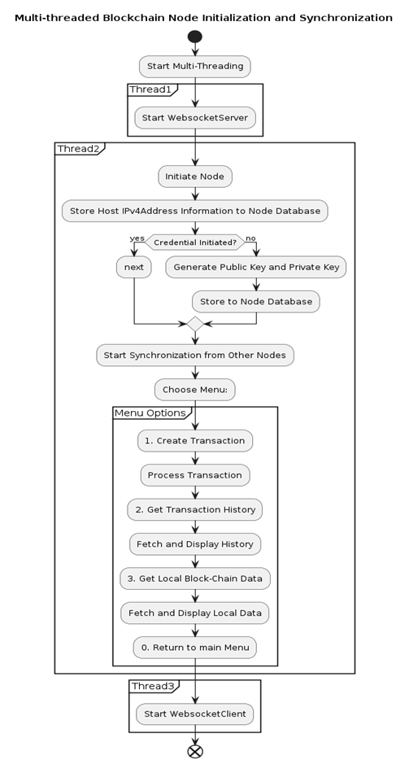
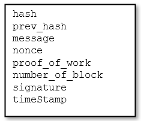
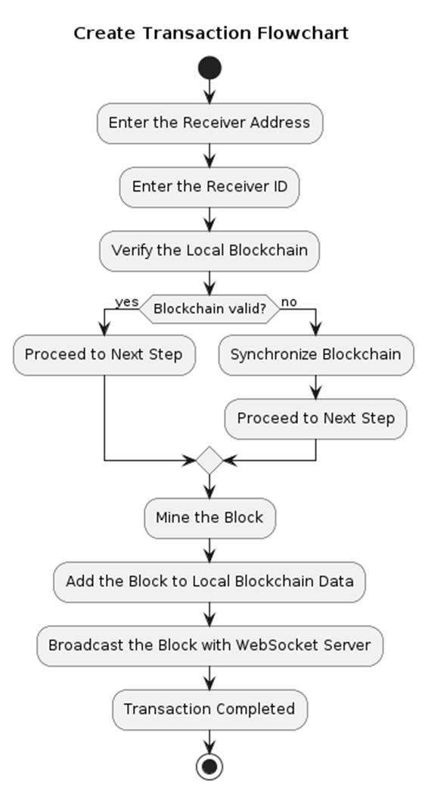
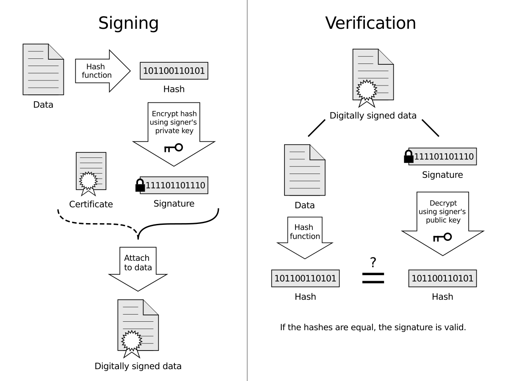
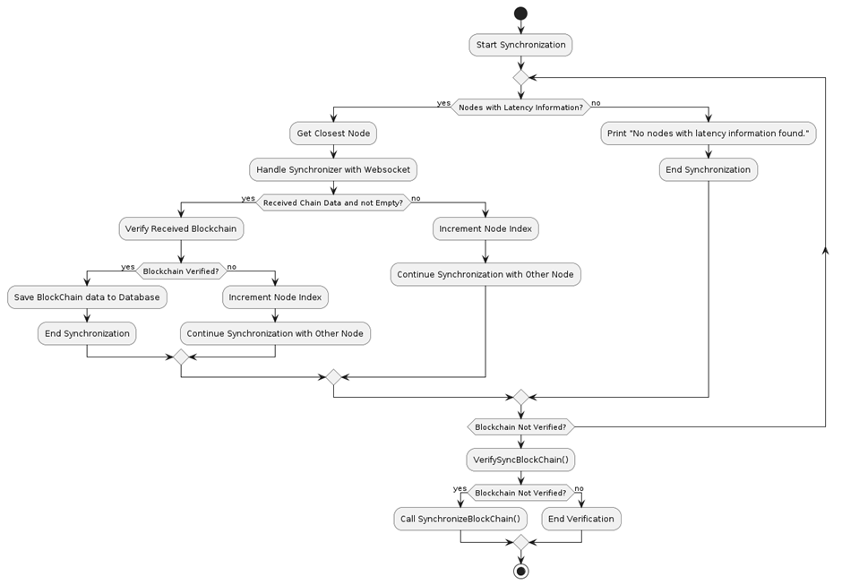
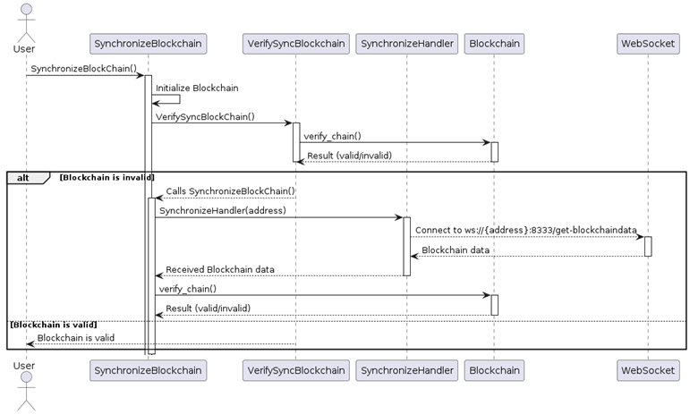
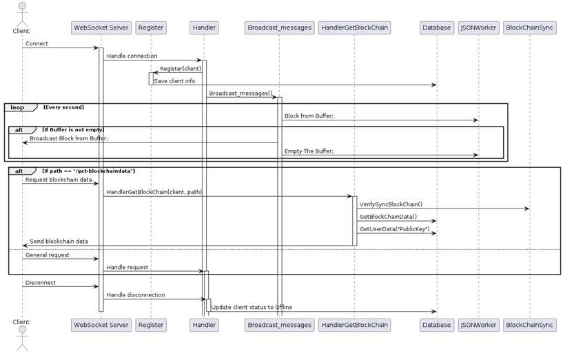
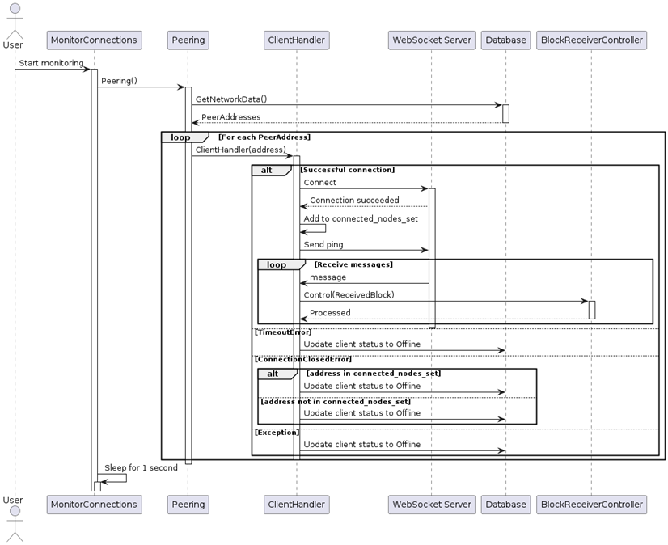

## Overview

I explore the implementation of graph modeling in peer-to-peer (P2P) networks utilizing blockchain technology via WebSocket protocols. The convergence of these technologies aims to enhance data security, reliability, and efficiency within decentralized networks. I leverage graph modeling to map out and optimize the interactions among nodes in a P2P network, providing a robust structure for data exchange and transaction verification. Blockchain technology is integrated to ensure immutability and trust in the network, while WebSocket facilitates real-time communication and data transfer.

My approach addresses key challenges such as latency, scalability, and fault tolerance, offering a comprehensive framework for secure and efficient P2P communication. The results demonstrate significant improvements in network performance, making this model a viable solution for applications requiring decentralized, real-time data exchange.

## Requirements

```text
mnemonic==0.21
asyncio==3.4.3
websockets==12.0
urllib3==1.26.14
ecdsa==0.19.0
tabulate==0.9.0
```

## Engineering Technique Analysis

#### *) Program workflow



#### 1. Block-chain Modelling

The use of block chain as a feature model implemented in decentralized based technology and utilizing Peer-To-Peer network as a communication medium. I modeled an abstraction of the block as follows:



```python
class Block:
    def __init__(self, hash = "", 
                 prev_hash = "", 
                 message = "", 
                 nonce = "", 
                 proof_of_work = "", 
                 number_of_block = 0, 
                 timeStamp = "", 
                 signature = ""):
        self.hash = hash
        self.prev_hash = prev_hash
        self.message = message
        self.nonce = nonce
        self.proof_of_work = proof_of_work
        self.number_of_block = number_of_block
        self.signature = signature
        self.timeStamp = str(datetime.datetime.now())

```

* **hash** : Contains the result of mapping data through a function into a simplified form called a digest.
* **prev_hash** : The hash of the previous block.
* **message** : The information stored in the block.
* **nonce** : A random number that must undergo computation or mining to meet the consensus algorithm when substituted into the hash function.
* **proof_of_work** : The number of computational steps required to find a nonce that satisfies the consensus algorithm when substituted.
* **number_of_block** : The current block number.
* **signature** : A cryptographic mechanism that ensures the security and authenticity of transactions. A signature serves as an identifier, ensuring that the stored information corresponds to the ownership of the block creator. The validity of the block is verified, in part, through the verification of its signature.
* **timeStamp** : Indicates the local time the block was mined.

##### 1.1. Block Mining


New blocks can be generated by mining. Mining is done by storing information records into the block model, then we will fill in the hash attribute along with the nonce with a series of processes that apply a consensus algorithm.

###### 1.1.1.	Hashing and Consensus Algorithms

The Hash attribute will contain the results of mapping data from the applied function into a simple form called digest. The hashing function used is as follows:

```python
sha256(currentBlock, prev_hash, signature, nonce, timeStamp)
```

###### 1.1.2.	Nonce Mining

We will do the process of finding a nonce value that satisfies so that
when substituted into the hash function will fulfill the consensus algorithm. Of course, finding this value requires a lot of computation because we will test one by one numbers from the range of 1 to 2<sup>256</sup> and how many steps it takes to find the appropriate nonce will be the value of the ```proof_of_work`` attribute.

In my project this time, I have tested with a value of ``DIFFICULTY = 2`` due to the limited test time and test device resources that I used :'(

```python
for mineNonce in range(1,2**(256)):
    hash_hex = str(Hash.hash(block.message, previous_hash, signature, mineNonce, block.timeStamp))
    hash_binary = ''.join(format(ord(x), '08b') for x in hash_hex)  
            if(str(hash_binary)[:2] == "00"): ## Here's the DIFFICULTY = 2
                block.prev_hash = previous_hash
                block.nonce = mineNonce
                block.hash = hash_hex
                block.proof_of_work = works
                break
            else:works+=1
```

###### 1.1.3.	Digital Signature

Signature creation requires a private key and a public key. This project uses <a href="https://xilinx.github.io/Vitis_Libraries/security/2021.2/guide_L1/internals/ecdsa_secp256k1.html">Ecdsa SECP256k1</a> as a Certificate generator. A signature is generated through a function mapping that takes the information and the private key as parameters later, it will be used for Assymetric Cryptographical data protection to authorized the data ownership and prevent from responsible action :

*Source : Wikipedia*

```python
def sign_message(private_key, message):
    return private_key.sign(message.encode('utf-8'))
```

##### 1.2. Block verification

Blocks that are generated, received, or distributed must go through a stage of verifying the validity and conformity between transactions and validity parameters such as hashes and signatures.

```python
def verify_block(self, block:Union[DictObj,'Block',Block])->BlockVerifyStatus:
        HashHex = str(Hash.hash(block.message, self.BlockChainData[-1]["hash"], block.signature, block.nonce, block.timeStamp))
        PublicKey = KeyGenerator.load_public_key_from_hex(KeyGenerator. ParseSender(block.message))
        VerifySignature = KeyGenerator.verify_signature(PublicKey,block.message, block.signature)
        VerifyStatus = BlockVerifyStatus()
        if(self.BlockChainData[-1]["hash"] == block.prev_hash and 
           block.hash == HashHex and 
           VerifySignature and 
           block.number_of_block == self.BlockChainData[-1]["number_of_block"] + 1):
            return True
```

###### 1.2.1.	Hash Verification

The hash in the block must be verified to match the transaction record in the block, and the ```prev_hash``` attribute must be validated to see whether it really matches the hash attribute value in the previous block.

```python
else:
            if(self.BlockChainData[-1]["hash"] != block.prev_hash):
                VerifyStatus.PreviousHashBlockError = True
                if(self.BlockChainData[-1]["prev_hash"] == block.prev_hash):
                    VerifyStatus.BlocksFork = True
            if(block.hash != HashHex):
                VerifyStatus.InvalidBlockHash = True
```

###### 1.2.2.	Digital Signature Verification

Signature verification is done by mapping the public key and information into a function.

```python
def verify_signature(public_key, message, signature):
    try:
        return public_key.verify(bytes.fromhex(signature), message.encode('utf-8'))
    except BadSignatureError:
        return False
```

```python
VerifySignature = KeyGenerator.verify_signature(PublicKey, block.message, block.signature)
```

```python
if(not VerifySignature):
    VerifyStatus.InvalidSignature = True
```

###### 1.2.3.	Block Order Verification

```number_of_block``` attribute must be validated for conformity to indicate whether the blockchain data it owns is in sync with others.

```python
if(block.number_of_block != self.BlockChainData[-1]["number_of_block"] + 1):
            VerifyStatus.MissedBlock = True
            VerifyStatus.BlockNumber = block.number_of_block
```

#### 2. Inter-Node Synchronization

Nodes will meet several conditions later, such as: (1) New nodes initiate themselves in the network; (2) Nodes lag behind block broadcasts due to being offline; (3) Nodes have invalid local block-chain data; (4) Nodes receive block broadcasts or mine blocks and then broadcast them; (5) Other conditions where the block-chain on a node does not follow the consensus algorithm and there are differences in the chain or block data with other nodes, to overcome this, synchronization steps are needed so that nodes can catch up with the block-chain or get valid local block-chain data.


Selecting the nodes to be requested for synchronization requires a specific approach with graph modeling concepts that will be discussed in the next chapter.

#### 3.	Peer-To-Peer Network

P2P Network allows us to create communication in a network without having to involve a server or intermediary. Someone can communicate directly. The selection of distribution with this network is very appropriate for its application with the principle of Decentralization. The creation of a P2P network can be done with the socket programming method which is made easier by the availability of the <a href="https://websockets.readthedocs.io/en/stable/">websocket library</a> in the Python Programming language.

```python
import asyncio
import websockets
```

##### 3.1.	Websocket Synchronization Network Handler



When the synchronization is done, we will create a connection to someone we call
as a peer on port **8333**, where we have set this port as the transport protocol for handling blockchain interactions.

```python
def SynchronizeHandler(address):
      with connect(f"ws://{address}:8333/get-blockchaindata") as websocket:
        while True:
            message = websocket.recv()
            if(message != ""):
                data = json.loads(message)
                return data
```

One can obtain other people’s block chain data by accessing the network via the path ```get-blockchaindata```. The peer we choose is the peer with minimum latency as explained in the beginning.

##### 3.2. Websocket Server Broadcast Network Handler


Websocket will create a server where others can connect to it. Once a block is successfully mined, it will be stored first in a buffer and then broadcasted to all online peers.

```python
async def main():
    hostname = socket.gethostname()
    NodeAddress = socket.gethostbyname(hostname)
    JSONWorker.EditDataJSON('Database/NodeDB.json',"NodeAddress",NodeAddress)
    print("Server Network Panel : ")
    async with websockets.serve(route, DB.GetUserData("NodeAddress"), 8333):
        # print("Server Is Starting ... ")
        await asyncio.Future()
```

Peers will be detected and recorded as nodes in the network when connecting to the server.

```python
async def Register(websocket):
    client_host = websocket.remote_address[0]
    start_time = time.time()
    await websocket.ping()
    await websocket.recv()
    latency = time.time() - start_time
    dict = {"IP":client_host,
           "LastChanged":str(datetime.datetime.now()),
            "Latency":latency,
            "Status":"Online"
            }
    DB.CreateNetworkData(client_host, dict)
```

Block broadcasting is done to all connected nodes and block distribution is done asynchronously, where all messages are sent simultaneously without having to wait for each other.

```python
async def Handler(websocket):
    CONNECTIONS.add(websocket)
    await Register(websocket)
    await Broadcast_messages()
```

The server will also record the activity of the connected nodes, if the node releases its connection it will be recorded as an offline node.

##### 3.3. Websocket Client Broadcast Network Handler


The broadcasted block will be received by each node through a handler run by the websocket client. First the client will establish a connection with all peers by connecting to the server address on port 8333.

```python
async def ClientHandler(address):
    try:
        async with websockets.connect(f"ws://{address}:8333") as websocket:
            print(f"Connection to {address} succeeded")
            connected_nodes_set.add(address)  # Tandai bahwa node berhasil terkoneksi
            await websocket.send("ping")
            while True:
                message = await websocket.recv()
                if message != '':
                    ReceivedBlock = json.loads(json.dumpmessage)
                    BlockReceiverController.Control(ReceivedBlock)
```

The blocks received from the network will be verified and then added to the local blockchain database. This process will also handle one of the scenarios such as block forks which will be discussed in the next chapter.

#### 4. Concurrency

Jobs such as multithreading and broadcasting will be very efficient if several processes can be done at the same time. Concurrency techniques are needed in this case and the availability of the asyncio library can help development.

```python
import asyncio
```

For example, the client and server handlers are run concurrently using the asynchronous function feature.

```python
from Network import WSClientHandler
import asyncio

asyncio.run(WSClientHandler.main())
```

```python
from Network import WSServerHandler
import asyncio

asyncio.run(WSServerHandler.main())
```

You can also read my theoretical Analysis about Graph Modelling [[ HERE ](assets/theoretical-analysis-blockchain-p2p-network.pdf)](assets/theoretical-analysis-blockchain-p2p-network.pdf)</a>

<iframe src="assets/theoretical-analysis-blockchain-p2p-network.pdf" width="300" height="1000"></iframe>
